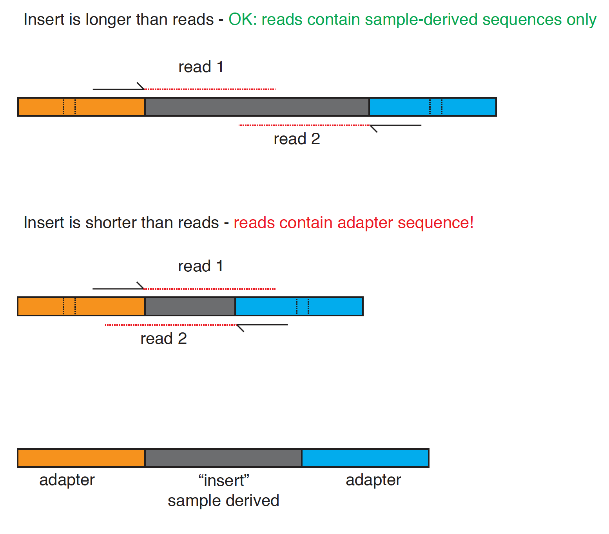

# Downloading and Cleaning-up Raw NGS Data
---

## In this exercise, we will download, process, and evaluate NGS datasets and genome sequences.  We will:

* Setup a computing environment using conda
* Download a dataset from the NCBI SRA database
* Use the FASTQC tool to assess the quality of the reads in the dataset
* Use cutadapt to remove low quality and adapter-derived parts of the reads
* Use the FASTQC tool to assess the quality of the reads in the dataset after trimming

---

## First: Install conda environment with software we'll need

Installing bioinformatics software can be challenging!  We will again use [Conda](http://anaconda.org) to install the software we need.  


Login to the thoth01 server:
```
ssh your_username@thoth01.cvmbs.colostate.edu
```

First, let's look for a command we need named `fastqc`. Check to see if fastqc is available to you using the `which` command:
```
# is fastqc in your PATH?
which fastqc
```

---
:question: **Questions:**
- Is `fastqc` in your `PATH`?  How do you know?
- What would happen if you tried to run the command `fastqc`?  (What does the shell output?)
---

Sadly, we don't have `fastqc` :confused:.  Let's solve that problem by creating a new "conda environment" with all the software we'll need for this class!

The tools are listed in [this file](../conda_environment/bio_tools.yaml).  

First, we'll download this yaml file and then we'll use `conda env create` to create a new environment.
```
# download the yaml file from github
curl -OL https://raw.githubusercontent.com/stenglein-lab/MIP_280A4_Fall_2022/main/conda_environment/bio_tools.yaml

# create the conda environment
conda env create --file bio_tools.yaml
```

To activate this conda environment, you will need to run:
```
conda activate bio_tools
```

:warning: **You will need to activate this environment every time you want to use these tools.**

---
:question: **Questions:**
- Now (with bio_tools activated), what is the output of the command `which fastqc`?
- Now (with bio_tools activated), what is the output of the command `echo $PATH`?  
- Based on the previous answer, how do you think conda environments relate to your `PATH`? 
- Another tool in this environment that we will use today is named `cutadapt`.  What version of `cutadapt` is in your `bio_tools` conda environment?  How did you figure that out?
---

## Downloading an SRA dataset

We will download one of the NGS datasets reported in [this paper](http://journals.plos.org/plospathogens/article?id=10.1371/journal.ppat.1004900)

This dataset was generated by performing shotgun sequencing of total RNA from the liver of a boa constrictor that was diagnosed with [inclusion body disease](https://en.wikipedia.org/wiki/Inclusion_body_disease). 


To get the dataset, open a browser and navigate to the pubmed page for the dataset's paper:

https://www.ncbi.nlm.nih.gov/pubmed/25993603

Scroll down and find the 'Related information' section of the bottom of the page.  Click on the link to the SRA database.  This shows the SRA datasets associated with this paper.  Scroll through the datasets until you find the one for `snake_7` (_not_ snake_7_viral).  Note that the reads in this dataset are supposedly already trimmed.  Note at the bottom of the page the run # (SRR #) for this dataset: `SRR1984309`.  This is an accession in the SRA database for this run.  You will need this accession to download the SRA data from the command line.

We're going to download this dataset using the command line tool `fastq-dump`, part of the [SRA toolkit](https://trace.ncbi.nlm.nih.gov/Traces/sra/sra.cgi?view=toolkit_doc).  First, let's create a directory (folder) in which to work.  Make sure you are ssh'ed into thoth01.  

change (move) to your home directory, if not already there
```
# running cd with no options moves you to your home directory
cd
```

make a new directory, named snake_exercise, or another name you like better
```
mkdir snake_exercise
```

move to that directory
```
cd snake_exercise
```

double check you are in the directory you think you are:
```
pwd
```

We will download the dataset using the `fastq-dump` tool, part of the [SRA toolkit](https://trace.ncbi.nlm.nih.gov/Traces/sra/sra.cgi?view=toolkit_doc).  We included the SRA toolkit in the conda environment we created earlier.

To run `fastq-dump`, you just need to specify the accession (the SRR#) of the dataset you want.  Recall that our accession is SRR1984309. The `--split-files` option of the command will create 2, synchronized files for the paired reads

```
# download the data from the SRA
fastq-dump SRR1984309 --split-files
```

Confirm that you downloaded the files.  You should see files named `SRR1984309_1.fastq` and `SRR1984309_2.fastq` that are each 44 Mb.

```
ls -lh
```

Have a look at the first 20 lines of the read1 fastq file using the head command:
```
head -20 SRR1984309_1.fastq 
```
---
:question: **Questions:**
- What are the first 6 bases of the first read?
- What are the quality scores - *in encoded single characters* - of the first 6 bases?
- What quality scores do these characters represent?
- What are the probabilities of incorrect basecall associated with these Q scores?
---

Have a look at the first 20 lines of both files:
```
head -20 SRR1984309_1.fastq SRR1984309_2.fastq 
```
---
:question: **Questions:**
- How does the first read in `SRR1984309_1.fastq` relate to the first read in `SRR1984309_2.fastq`?  
- How many reads are in each file?  (Hint: the `wc -l name_of_file` command will tell you the number of *lines* in the file)

<br>

---

## Using FastQC to evaluate quality of NGS data

[FastQC](https://www.bioinformatics.babraham.ac.uk/projects/fastqc/) is a tool that: 

> ... aims to provide a simple way to do some quality control checks on raw sequence data coming from high throughput sequencing pipelines. It provides a modular set of analyses which you can use to give a quick impression of whether your data has any problems of which you should be aware before doing any further analysis

Performing a check like this of your data is one of the first things you'll want to do when you receive your new sequencing data (or when you download a dataset from an online repository like the SRA).  Running fastqc from the command line is easy: you just provide the names of the fastq files you want to analyze.

``` 
fastqc SRR1984309_1.fastq SRR1984309_2.fastq
```

The output of fastqc are html files that contain a report describing various aspects of the data.  Transfer these html files to your laptops and open them in a browser.  The class will discuss these results together.


## Cleaning raw NGS data

NGS data can have problems.  Two main problems are:

1. Often, NGS reads contain adapters sequences.  This happens when the library molecules are too short, and the sequence reads go all the way through the insert (the part of the library molecule derived from the sample) and into the opposite adapter.



2. Quality tends to decrease towards the ends of Illumina reads.  It is good to trim off low quality bases from the ends of reads.

[cutadapt](https://cutadapt.readthedocs.io/en/stable/) is a tool that can be used to trim low quality and adapter sequences from NGS reads.  

We will run this cutadapt command to trim our reads:

```
cutadapt \
   -a CTGTCTCTTATACACATCT \
   -A CTGTCTCTTATACACATCT \
   -q 30,30 \
   --minimum-length 80 \
   -o SRR1984309_1_trimmed.fastq \
   -p SRR1984309_2_trimmed.fastq \
   SRR1984309_1.fastq \
   SRR1984309_2.fastq \
   | tee cutadapt.log
``` 

Note that using a `\` as the last character of a command line allows you to split commands over multiple lines.  This can improve readability of long commands.

Let's breakdown the [cutadapt options](https://cutadapt.readthedocs.io/en/stable/guide.html) that we used:

| Part | Meaning |
| ---- | ------- |
| cutadapt | the name of the command |
| -a CTGTCTCTTATACACATCT | -a: remove a sequence from the 3' end of reads.<br>CTGTCT... = the Nextera-style adapter sequence to remove.|
| -A CTGTCTCTTATACACATCT | -A: remove a sequence from the 3' end of *paired* reads. |
| -q 30,30 | trim bases with Q scores < 30 from 5' and 3' ends of reads |
| --minimum-length 80 | only keep reads that are >= 80 bases after trimming |
| -o SRR1984309_1_trimmed.fastq | the name of a new file that will contain trimmed reads. |
| -p SRR1984309_2_trimmed.fastq | the name of a new file that will contain trimmed paired reads. |
| SRR1984309_1.fastq | an input file containing reads. |
| SRR1984309_2.fastq | an input file containing paired reads. |
| | tee cutadapt.log | see question below |


OK, let's confirm that the trimmed read fastqs exist. Cutadapt should have created 2 new fastq files and a log file:

```
ls -lh
```

---
:question: **Questions: (hint: look in cutadapt.log for answers)**
- What does the `| tee cutadapt.log` do in the command above?
- What percentage of all bases were quality-trimmed (hint: see `cutadapt.log`)?
- What percent of read1 reads contained adapter sequence?
- What percent of read pairs made it through the filtering?
---


Now, we can run `fastqc` again to analyze the trimmed datasets:
```
# run a fastq command to generate reports describing the trimmed fastq files
# (I'm not going to tell you the command: you have to figure it out)
```

Transfer the fastq html files to your computer and open them html files in a browswer and answer these questions:

---
:question: **Questions:**
- What command did you use to run fastqc on the trimmed fastq?
- How many read pairs remain after trimming?
- Did the trimming remove Nextera adapters?
---

Note: There are many other trimming tools besides cutadapt. Other popular trimming tools include [BBDuk](https://jgi.doe.gov/data-and-tools/software-tools/bbtools/bb-tools-user-guide/bbduk-guide/) and [fastp](https://github.com/OpenGene/fastp)


