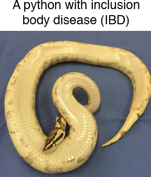

# Downloading and Processing Datasets and Genomes exercise
---

## In this exercise, we will download, process, and evaluate NGS datasets and genome sequences.  We will:

* Download a dataset from the SRA
* Use the FASTQC tool to assess the quality of the reads in the dataset
* Use cutadapt to remove low quality parts of the reads1
* Find and download genome sequences and associated annotation from NCBI

---

## First: Install conda environment with software we'll need

Installing bioinformatics software can be challenging!  We will again use [Conda](http://anaconda.org) to install the software we need.

You will create a new conda environment that includes the tools you'll need for the remainder of this exercise on the thoth01 server.  The tools are listed in [this file](../conda_environment/mip_280_conda.yaml)

Login to the thoth01 server:
```
ssh your_username@thoth01.cvmbs.colostate.edu
```

Create a new conda environment named bio_tools by running this command
```
# download the yaml file from github
curl -OL https://raw.githubusercontent.com/stenglein-lab/MIP_280A4_Fall_2022/main/conda_environment/bio_tools.yaml

# create the conda environment
conda env create --file bio_tools.yaml
```

To activate this conda environment, you will need to run:
```
conda activate bio_tools
```

**You will need to activate this environment every time you want to use these tools.**


## Second: Downloading an SRA dataset

We will download one of the NGS datasets reported in [this paper](http://journals.plos.org/plospathogens/article?id=10.1371/journal.ppat.1004900)

This dataset was generated by performing shotgun sequencing of total RNA from the liver of a boa constrictor that was diagnosed with [inclusion body disease](https://en.wikipedia.org/wiki/Inclusion_body_disease). The dataset is composed of reads from host RNAs and from viral RNAs.  



To get the dataset, open a browser and navigate to the pubmed page for the dataset's paper:

https://www.ncbi.nlm.nih.gov/pubmed/25993603

Scroll down and find the 'Related information' section of the bottom right of the page.  Click on the SRA link.  This shows the SRA datasets associated with this paper.  SCroll through the datasets until you find the one for `snake_7` (not snake_7_viral).  Note that the reads in this dataset are supposedly already trimmed.  Note at the bottom of the page the run # (SRR #) for this dataset: SRR1984309

We're going to download this dataset using the command line tool fastq-dump, part of the [SRA toolkit](https://trace.ncbi.nlm.nih.gov/Traces/sra/sra.cgi?view=toolkit_doc).  First, let's create a directory (folder) in which to work.  Open the terminal app on your laptop and type these commands:

change (move) to your home directory, if not already there
```
# running cd with no options moves you to your home directory
cd
```

make a new directory, named snake_exercise, or another name you like better
```
mkdir snake_exercise
```

move to that directory
```
cd snake_exercise
```

double check you are in the directory you think you are:
```
pwd
```

We will download the dataset using the fastq-dump tool, part of the [SRA toolkit](https://trace.ncbi.nlm.nih.gov/Traces/sra/sra.cgi?view=toolkit_doc).  We included the SRA toolkit in the conda environment we created earlier.

To run fasta-dump, you just need to specify the run # (the SRR#) of the dataset you want.  Recall that our run # is SRR1984309. The --split-files option of the command will create 2, synchronized files for the paired reads

```
fastq-dump SRR1984309 --split-files
```

Confirm that you downloaded the files.  You should see files named SRR1984309_1.fastq and SRR1984309_2.fastq that are each 44 Mb.

```
ls -lh
```

Have a look at the first 20 lines of the fastq files using the head command
```
head -20 SRR1984309_1.fastq SRR1984309_2.fastq
```

- What is on each of the 4-lines that make up each sequence?  (See: [FASTQ format](https://en.wikipedia.org/wiki/FASTQ_format))  
- The quality scores for this dataset are in Illumina 1.9 format.  What is the maximum quality score for each basecall?  How does that relate to the estimated probability that a basecall is wrong?
- How many reads are in each file?  (Hint: the `wc -l name_of_file` command will tell you the number of lines in the file)


---

#### We will possibly stop here today


### Using FastQC to evaluate quality of NGS data

[FastQC](https://www.bioinformatics.babraham.ac.uk/projects/fastqc/) is a tool that: 

> ... aims to provide a simple way to do some quality control checks on raw sequence data coming from high throughput sequencing pipelines. It provides a modular set of analyses which you can use to give a quick impression of whether your data has any problems of which you should be aware before doing any further analysis

Performing a quick check like this of your data is one of the first things you'll want to do when you receive your new sequencing data (or when you download a dataset from an online repository like the SRA).

FastQC can be used via a graphical interface or via the command line.  On your laptops, the FastQC graphical interface is on the Desktop in: /GDW_Apps/FastQC

Navigate to that folder and open FastQC.  Then open the fastq files you downloaded from the SRA.  FastQC will take a couple seconds to analyze them.

These datasets have already been pre-cleaned, so they look pretty good.  Note that there is possible Nextera adapter contamination towards the end of some reads.  This makes sense, because the libraries were made with the Nextera protocol.  In the next class, we will trim those off.


